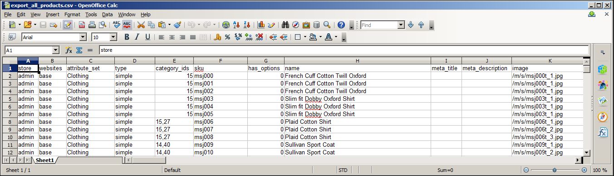

 - [Buy It](https://merchantprotocol.com/store/magento-extensions/magento-v1-0/advanced-dataflow.html)
 - [Demo It](http://demo.merchantprotocol.com/M1-advanced-data-flow)
 - [Forum: Talk About It](https://merchantprotocol.com/forums/forum/magento-plugin-forum/advanced-dataflow/)

The “Advanced Dataflow” extension is a set of additional adapters and parsers to increase the Magento Dataflow flexibility. As you may know, Magento migration processes are introduced with profiles. Each profile is a combination of actions (adapters / parsers / mappers) to transfer data from one format into another. The adapters and parsers variety makes the migration process flexible. Magento enables customers and products (with or without an inventory) to be exported / imported using CSV or Excel XML formats. The “Advanced Dataflow” extends default bounds to cover more needs. The most essential “Advanced Dataflow” feature is the order import and export. It appends orders to list of available entities to migrate.

Read more about [Dataflow HERE](http://docs.magento.com/m1/ce/user_guide/store-operations/dataflow.html)

Magento Dataflow is a data exchange framework that can be used by both merchants and developers. The basic Dataflow tool includes preconfigured profiles that make it easy to import and export product and customer data. The profiles can be used as they are, or be modified to meet your needs. You can create additional profiles for operations that are performed on a regular basis. For more sophisticated applications, Advanced Profiles can be defined in XML to perform custom data exchange operations.

The following instructions show how to use Dataflow profiles to export all product data, and import new product images.
-

## Step 1: Export All Products

1. 	Before you begin, make sure that all changes to the product data have been saved.
2. 	On the Admin menu, select System > Import/Export > Dataflow - Profiles.
3. 	In the list of profiles, select Export All Products.
4. 	In the panel on the left, click  Run Profile.

5. 	To begin the process, click the Run Profile in Popup button.

6. 	Wait a few moments for the profile to begin execution. The length of time it takes to complete the process depends on the size of the database. Do not close the window.

7. 	When the process is complete,you can find the exported CSV file in the following location on the server:

		[magento-install-dir]/var/export/export_all_products.csv

Here’s how the exported data file looks from the command line of the server:

8. 	Use an SFTP utility to download the export_all_products.csv file from the server to your desktop.

9. 	Then, open the file in any editor that supports UTF-8 encoding, such as [Notepad++](http://notepad-plus-plus.org/) or [OpenOffice Calc](https://www.openoffice.org/). To open the CSV file in OpenOffice Calc, specify a comma as the separator, and double quotes as the text delimiter.

The CSV data appears in the spreadsheet as rows of product records organized into columns of attributes, with the Attribute Code in the header of each column.

## Step 2: Copy the Product Images to the Server

The CSV file contains a path to each product image, but the actual image files must be uploaded to the server. To make the images available to import, place them in the media/import directory.

	[magento-install-dir]/media/import

Use your SFTP utility to copy the product images that you want to import to the media/import folder.

## Step 3: Edit the CSV File

1. 	Edit the data as needed.
2. 	Save your changes to the CSV file.

For this example, we will add three new images to SKU #hdb005. Because this is the only product record that we’re going to update, the others can be deleted from the CSV file.

Currently, this product has only one image that is used for the base image, small image, and thumbnail. Because we’re going to now offer this product in three colors, we need to upload an image for each color, and replace the image that’s currently assigned to the product. Because this is a simple product, we can later use Custom Options to add an option for each color.

Magento creates a directory structure of product image files that is organized alphabetically. You can see that path before each image file name in the CSV data. However, when you import images, you must never include that path before the file name. The only thing you have to do is enter a forward slash before the file name of each image that you want to import. Magento takes care of the rest. For this example, we need to add the three image files that were uploaded to the media/import folder.

	/hdb005_HOTP_600.jpg
	
    /hdb005_MARM
	
    /hdb005_SALM_600.jpg

In the data, we will replace the original image file name, and add the other two image file references on separate blank lines. just below the original row. You must also enter the SKU on each additional line, to associate the images with the product.

## Step 4: Import the Products

1. 	On the Admin menu, select System > Import/Export > Dataflow - Profiles.
2. 	In the list of profiles, select Import All Products.

This general-purpose profile can be used to import or update any number or product records.

3. 	In the panel on the left, select Upload File.

4. 	Because we’re uploading only one file, click the Browse button for File 1. Then, find the file on your computer and click to select it. The path to the file appears in the input box.
5. 	Click the Save and Continue Edit button.

6. 	In the panel on the left, select Run Profile.
7. 	Select the CSV file that you edited. If there are several files in the list, make sure to select the right one. Then, click the Run Profile in Popup button.

8. 	Wait a few moments for the profile to begin the import process. Do not close the window or interrupt the process. Look for the “Finished Profile Execution” message at the bottom of the list when the import process is complete. If you receive an error message, correct the problem in the CSV file, and try again.

## Step 5: Update the Index

Usually the index needs to be updated after changes are made to product data. If you receive a message that the indexes are out of date, click the link and update the index.
