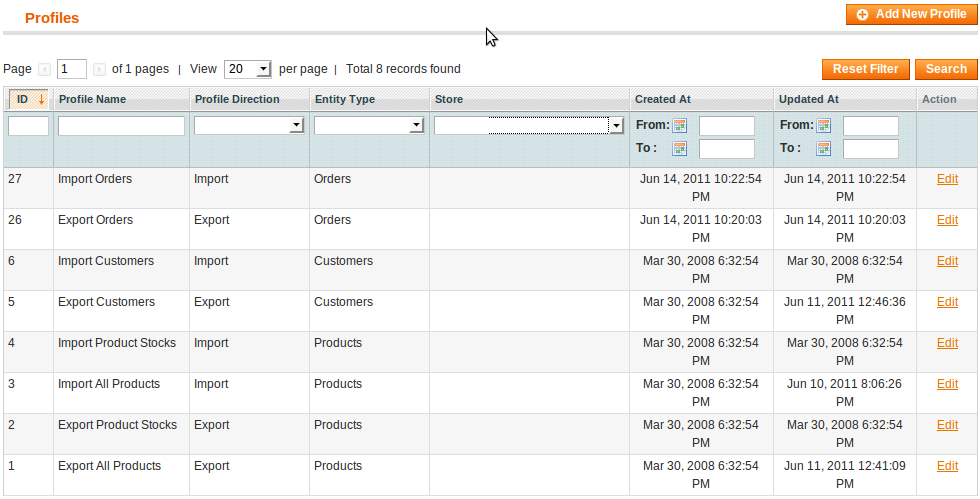
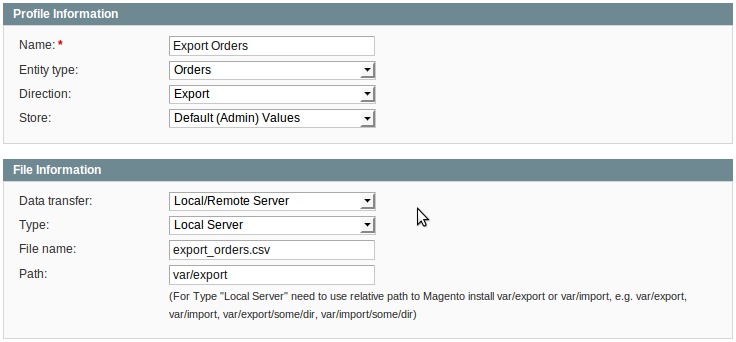
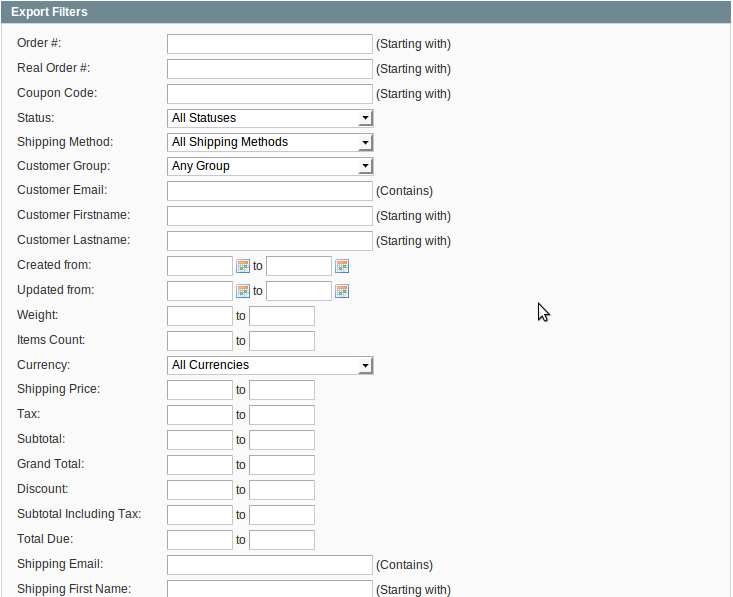
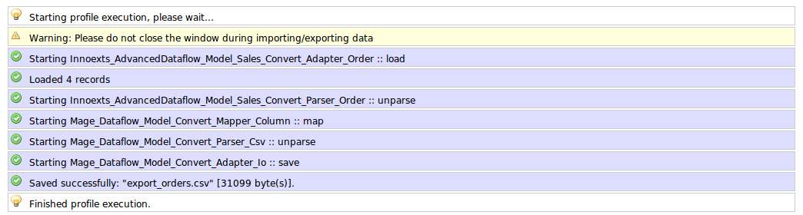
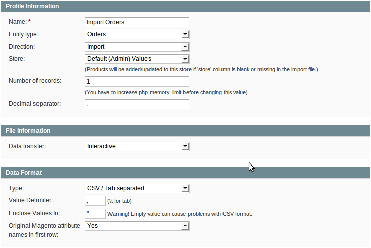

In menu: System -> Import / Export -> Dataflow – Profiles

The profiles manager has the additional “Orders” entity type and 2 corresponding profiles to import and export orders.

## Export Orders

The “Export Orders” profile wizard is similar to “Export Customers” and “Export Products” profiles but with their own filters based on shipping, billing, items or orders attributes itself. Select the “Run Profile” tab and push the “Run Profile in Popup” button. The output file should be like this.

## Import Orders

Choose input method in “File Information” section and data format.

